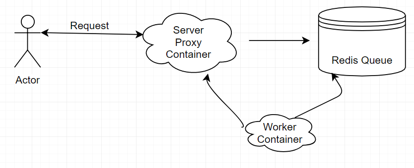

# Demo Python proxy webserver

# About this project

Offers a web server dispatcher which tries to present some of the core concepts of micro services.
The way this webserver proxy works is the following:

1. The reverse proxy "front-end" server will take any incoming request and save it in a Redis Queue.
2. A pool of workers will wait for any new items to appear in the Redis Queue.
3. Once the new request shows up, a worker picks it up and returns it to the server component.

## Sample workflow:

## Other notes:

* also includes a Travis CI pipeline which lints, tests the code, builds and pushes the docker images which will be used in the Kubernetes cluster.